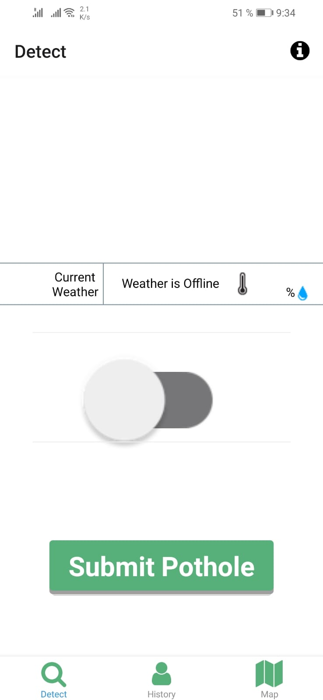
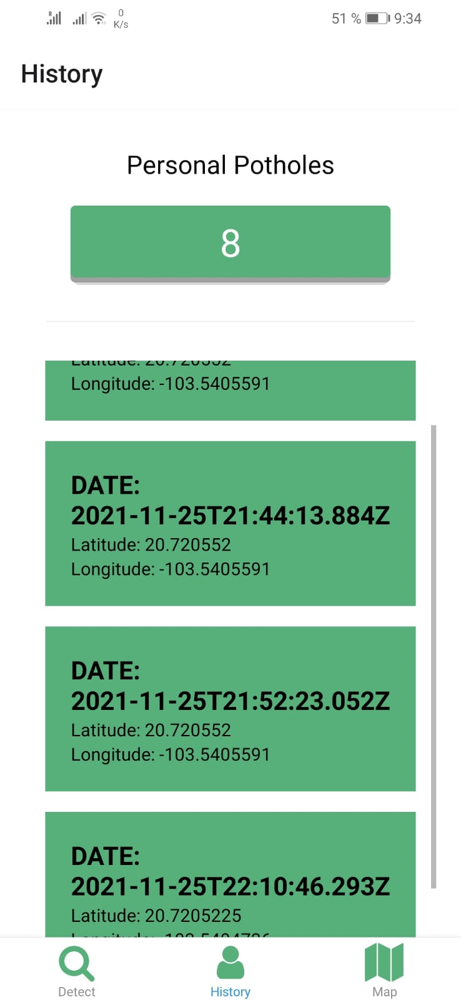
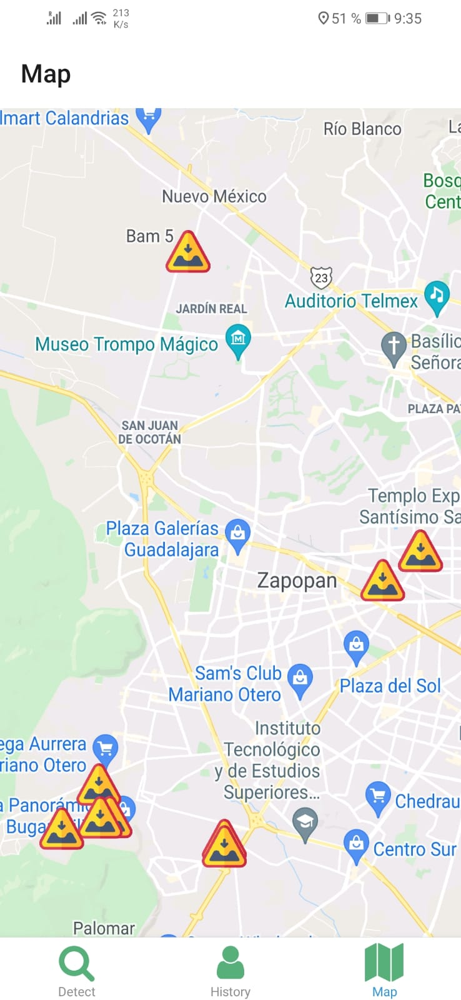

<div id="top"></div>

[![Contributors][contributors-shield]][contributors-url]
[![Forks][forks-shield]][forks-url]
[![Stargazers][stars-shield]][stars-url]
[![Issues][issues-shield]][issues-url]
[![LinkedIn][linkedin-shield]][linkedin-url]
[![LinkedIn][linkedin-shield]][linkedin-url2]

<!-- PROJECT LOGO -->
<br />
<div align="center">
  <a href="https://github.com/JMicalco/ChaleBache-rn">
    
  </a>

<h3 align="center">ChaleBache - Mobile</h3>

  <p align="center">
    React Native app that detects possible potholes
    <br />
    <a href="https://github.com/JMicalco/ChaleBache-rn"><strong>Explore the docs »</strong></a>
    <br />
    <br />
    <a href="https://ChaleBache-rn.vercel.app">View Demo</a>
    ·
    <a href="https://github.com/JMicalco/ChaleBache-rn/issues">Report Bug</a>
    ·
    <a href="https://github.com/JMicalco/ChaleBache-rn/issues">Request Feature</a>
  </p>
</div>

<!-- ABOUT THE PROJECT -->

## About The Project

Moblie app that focsuses to detect potholes through the use of the accelerometer and geroscope sensor, it detects the latitude and longitude of such pothole and sends the data to an API

<p align="right">(<a href="#top">back to top</a>)</p>

### Built With

- [React Native](https://reactnative.dev)
- [Expo](https://expo.dev)

<p align="right">(<a href="#top">back to top</a>)</p>

<!-- GETTING STARTED -->

## Getting Started

To get a local copy up and running follow these simple example steps.

### Prerequisites

- [Node.js](https://nodejs.org/en/)

Install Expo

```sh
npm install --global expo-cli
```

### Installation

1. Clone the repo
   ```sh
   git clone https://github.com/JMicalco/ChaleBache-rn.git
   ```
2. Install NPM packages
   ```sh
   npm install
   ```
   ```sh
   npm install --save react-native-toast-message
   ```

### Ho to run

```sh
  npm start
```

or

```sh
  expo start
```

<p align="right">(<a href="#top">back to top</a>)</p>

<!-- USAGE EXAMPLES -->

## Usage

### Detect Potholes

- Use the switch button to turn on or off the sensor to detect potholes and
- Use the submit button to manually submit a pothole

<p align="center">

</p>

### View history of Detected potholes through that device

<p align="center">

</p>

### Map

- Click on any pothole pin to visualize their id and detected time
- The user's location is displayed by a blue circle with a small triangle facing in the user's direction (This representation may vary between devices. If the application is run in an emulator the user location may not be displayed due to the emulator not having a default location configured yet.)

<p align="center">

</p>

<p align="right">(<a href="#top">back to top</a>)</p>

## Contact

- José Adolfo Sánchez Micalco - [@Joseph_Micalco](https://twitter.com/Joseph_Micalco) - jmicalco@gmail.com - [Linkedin][linkedin-url]
- Daniel E. Velázquez Lara - danielvelara@gmail.com - [Linkedin][linkedin-url2]

<p align="right">(<a href="#top">back to top</a>)</p>

[contributors-shield]: https://img.shields.io/github/contributors/JMicalco/ChaleBache-rn.svg?style=for-the-badge
[contributors-url]: https://github.com/JMicalco/ChaleBache-rn/graphs/contributors
[forks-shield]: https://img.shields.io/github/forks/JMicalco/ChaleBache-rn.svg?style=for-the-badge
[forks-url]: https://github.com/JMicalco/ChaleBache-rn/network/members
[stars-shield]: https://img.shields.io/github/stars/JMicalco/ChaleBache-rn.svg?style=for-the-badge
[stars-url]: https://github.com/JMicalco/ChaleBache-rn/stargazers
[issues-shield]: https://img.shields.io/github/issues/JMicalco/ChaleBache-rn.svg?style=for-the-badge
[issues-url]: https://github.com/JMicalco/ChaleBache-rn/issues
[linkedin-shield]: https://img.shields.io/badge/-LinkedIn-black.svg?style=for-the-badge&logo=linkedin&colorB=555
[linkedin-url]: www.linkedin.com/in/josé-adolfo-sánchez-micalco-b14864140
[linkedin-url2]: www.linkedin.com/in/danielvelara
[product-screenshot]: Images/Main.png
